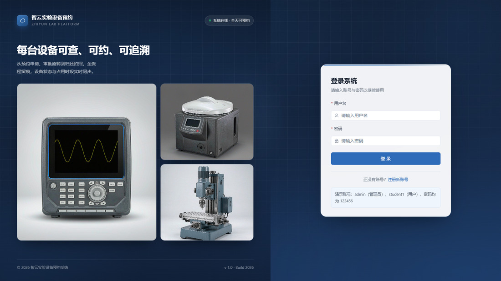
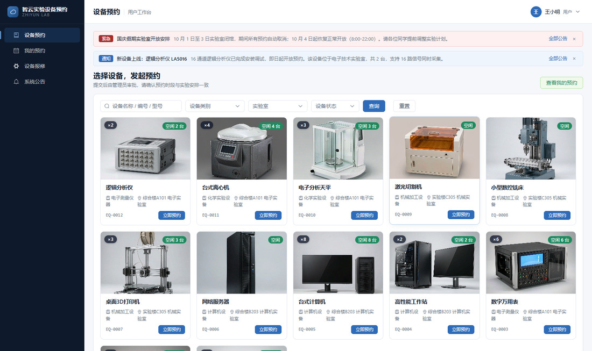
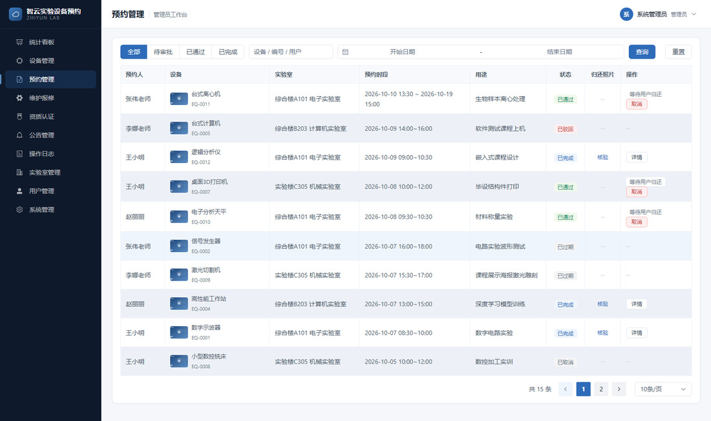
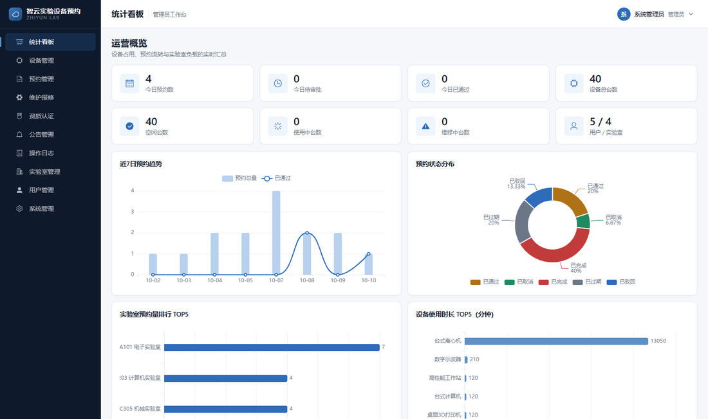
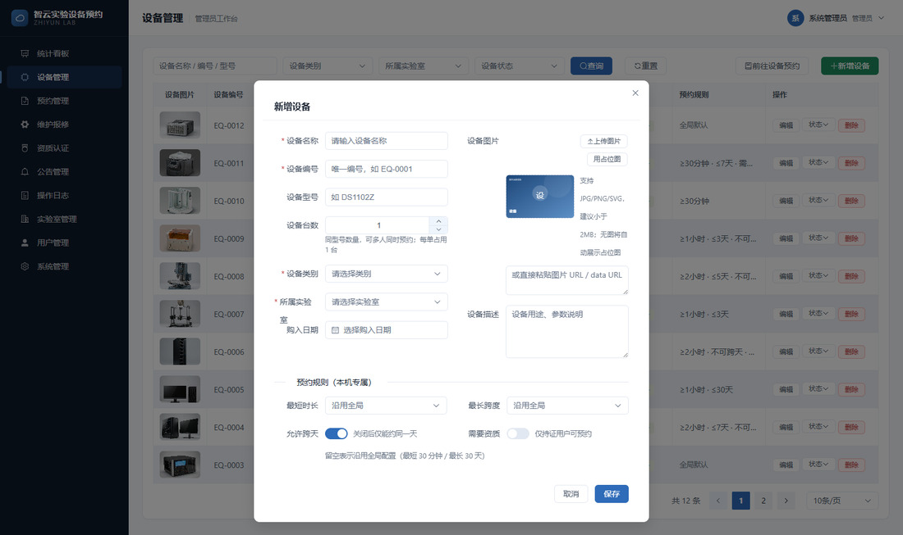
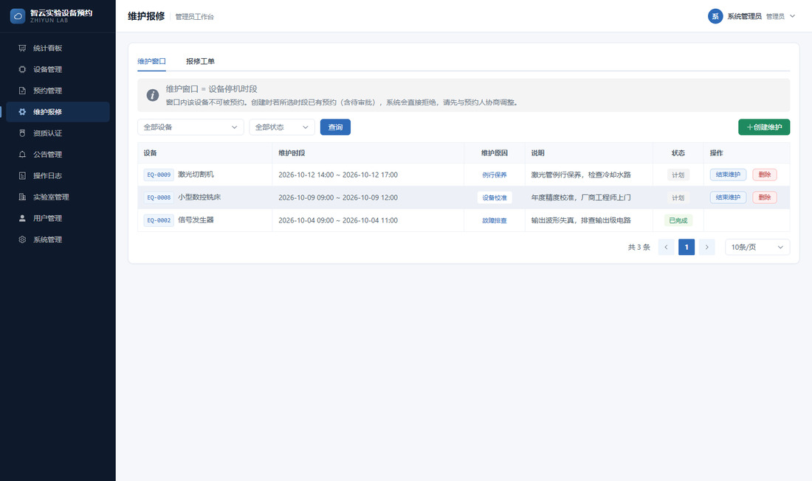
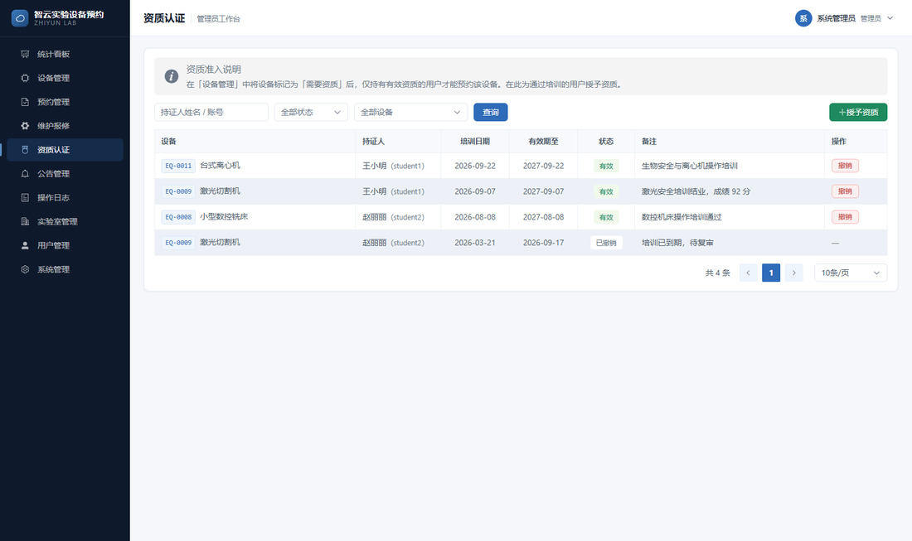
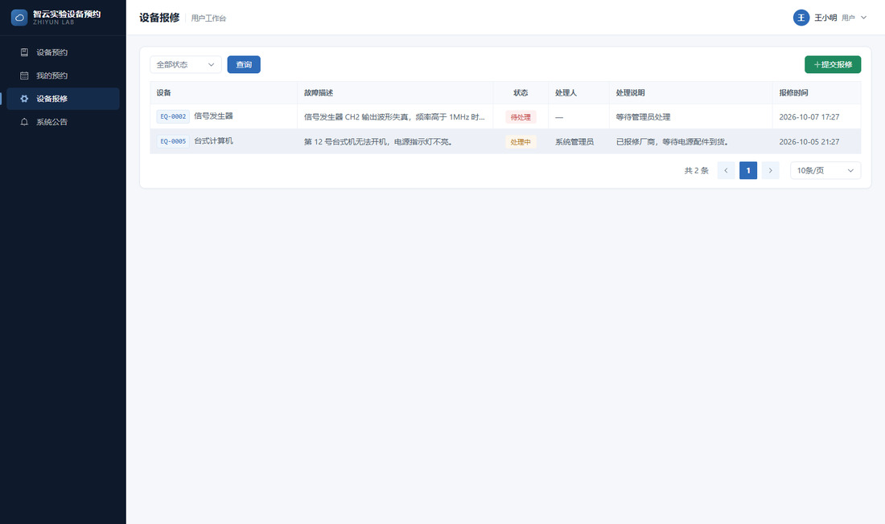

# 智云实验设备预约管理系统

高校实验室设备预约管理 Web 应用：**用户端**浏览带图设备、发起预约、**自助拍照归还**；**管理端**维护设备（含设备配图）、审批与核验用户归还的留痕照片、统计看板等。**前后端分离**，数据库内置演示数据，开箱即用。

## 系统预览

<table>
<tr>
<td width="50%"></td>
<td width="50%"></td>
</tr>
<tr>
<td><sub><b>登录页</b> · 深蓝科技背景 + 居中玻璃卡，管理员与普通用户共用一个入口</sub></td>
<td><sub><b>用户端设备预约</b> · 图片卡片网格、实时库存状态（空闲 N 台 / 已约满 / 维修中）与公告横幅</sub></td>
</tr>
<tr>
<td></td>
<td></td>
</tr>
<tr>
<td><sub><b>预约管理</b> · 审批 / 驳回 / 核验用户归还的留痕照片，支持跨天时段展示</sub></td>
<td><sub><b>统计看板</b> · 台数口径的设备概览、近 7 日趋势与设备使用排行</sub></td>
</tr>
<tr>
<td></td>
<td></td>
</tr>
<tr>
<td><sub><b>仪器级预约规则</b> · 每台设备可单独配置最短时长 / 最长跨度 / 是否跨天 / 是否需资质</sub></td>
<td><sub><b>维护窗口</b> · 设备停机排期，与已有预约冲突时直接拒绝创建</sub></td>
</tr>
<tr>
<td></td>
<td></td>
</tr>
<tr>
<td><sub><b>资质准入</b> · 需持证设备仅持有效资质的用户可预约，支持授予 / 撤销 / 过期</sub></td>
<td><sub><b>设备报修</b> · 用户提交报修并跟踪进度，管理员受理 → 完成，形成运维闭环</sub></td>
</tr>
</table>

> 以上截图取自本仓库自带的演示数据，按「五、快速启动」跑起来即可复现。

## 一、技术栈

| 端 | 技术 |
|----|------|
| 后端 | Spring Boot 2.7.18、MyBatis-Plus 3.5.3、MySQL 8.0、JWT（jjwt）、BCrypt、AOP、@Scheduled |
| 前端 | Vue 3 + Element Plus + ECharts（依赖已内置 `frontend/lib/`，无 CDN、无构建步骤，**完全离线运行**） |
| 部署 | 支持单端口模式：**嵌入式 H2** 替代 MySQL + 前端由后端托管，便于云端部署与分享 |
| 开发环境 | JDK 8+、Maven 3.6+；完整模式另需 MySQL 8.0（单端口模式无需） |

## 二、系统特色

- **设备图配**：每台设备支持自定义图片（管理员可上传/URL/占位），用户端卡片视图与详情弹窗直接展示。
- **自助归还拍照留痕**：预约人使用完设备后，在"我的预约"对已通过的预约拍照/上传归还照片提交，照片与归还时间、备注存档；管理员在"预约管理"核验查看。
- **设备库存（多台同型）**：每台设备可设置总台数 `stock`（≥1），同一设备同一时段支持多人预约（上限=总台数），每单占 1 台；卡片实时显示"空闲 X/Y 台 / 已约满 / 维修中"与 `×N` 角标；保留 `REPAIR` 维修态（不可约）。统计看板按台数累计（总台数 / 空闲 / 使用中 / 维修中）。
- **跨天连续预约**：预约支持起止日期区间（单日兼容），单次最长 30 天（含首尾），时长校验改用 `end_date - date + 1`。
- **仪器级预约规则**：每台设备可单独配置**最短时长 / 最长跨度 / 是否允许跨天**，未配置则自动回退全局配置（`sys_config`）；同一系统内示波器可"最少 2 小时、不可跨天"，离心机可"30 分钟、可跨天"。
- **资质准入**：设备可标记「需要操作资质」，此时仅持**有效资质**的用户可预约；资质含培训日期与有效期，支持授予 / 撤销 / 过期标记，到期自动失效。
- **维护窗口（停机排期）**：管理员为设备创建维护时段（例行保养 / 设备校准 / 耗材更换 / 安全检查 / 故障排查 / 软件升级），窗口内设备**不可预约**；创建时若所选时段已有预约（含待审批）则**直接拒绝**，避免产生矛盾数据。
- **报修工单**：用户可对设备提交报修并跟踪进度，管理员受理（处理中）→ 完成，处理说明双向可见，形成运维闭环。
- **公告栏**：管理员发布/编辑/关闭公告，支持**通知 / 注意 / 紧急**三级；用户端设备预约页顶部展示可关闭横幅，并可进入「系统公告」列表页查看全部。
- **操作日志**：AOP 切面自动记录登录、审批、设备变更、公告发布等关键操作，管理端支持按操作类型与关键字检索留痕。
- **角色模型简化**：学生/教师统一为普通 **用户** 角色；管理员端与用户端菜单与首页分离。
- **离线可演示**：前端所有依赖（Vue、Element Plus、ECharts、Axios、中文语言包）已内置到 `frontend/lib/`，答辩现场无网也能完整跑。
- **一键部署 / 在线分享**：提供 `cloud` 运行模式——内置 H2 数据库 + 前端由后端托管，**一个 jar、一个端口**即可运行，无需安装 MySQL；可直接部署到云开发环境，生成链接供他人在线访问（见 [`docs/云端部署指南.md`](docs/云端部署指南.md)）。

## 三、功能模块

1. **用户管理**：注册/登录、JWT 鉴权、角色（管理员/用户）、用户增删改查、重置密码、禁用账号即时生效。
2. **设备管理**（管理员）：设备 CRUD、类别/实验室/状态多条件检索、**设备图片维护**（上传/URL/占位）、维修状态维护、乐观锁版本控制。
3. **设备预约**（用户）：**图片卡片网格**浏览、关键字/类别/实验室/状态筛选、设备详情弹窗、立即预约。
4. **预约管理**（管理员）：所有预约筛选、审批/驳回、**核验用户归还照片**、取消、详情查看。
5. **我的预约**（用户）：本人预约列表、取消、查看审批意见。
6. **实验室管理**（管理员）：实验室信息维护、与设备关联、开放时间约束。
7. **系统管理**（管理员）：统计看板（趋势/状态分布/排行）、系统配置（改即生效）。
8. **公告栏**：管理员发布/编辑/关闭公告（通知/注意/紧急三级）；用户端顶部横幅 + 公告列表页。
9. **操作日志**（管理员）：记录登录、审批、设备变更、公告发布等关键操作，支持按操作类型与关键字检索。
10. **维护与报修**：
    - 维护窗口（管理员）：设备停机排期，窗口内不可预约，与已有预约冲突则拒绝创建；
    - 报修工单（用户提交 + 管理员处理）：用户提交报修并跟踪进度，管理员受理 → 完成闭环。
11. **资质认证**（管理员）：为设备授予/撤销用户操作资质（含培训日期与有效期）；需资质设备仅持证用户可预约。

## 四、项目结构

```
lab-equipment-reservation/
├── backend/                     # Spring Boot 后端
│   ├── pom.xml
│   └── src/main/
│       ├── java/com/lab/equipment/
│       │   ├── controller/      # 接口层（含 announcement/maintenance/qualification/repair 四个新模块）
│       │   ├── service/         # 业务层（核心 ReservationService 含 8 步预约校验链）
│       │   ├── mapper/          # MyBatis-Plus Mapper
│       │   ├── entity/          # 11 张表实体（设备规则字段 / 维护窗口 / 资质 / 报修工单 / 公告）
│       │   ├── dto/ vo/         # 请求/响应对象（CompleteRequest 新增）
│       │   ├── interceptor/     # JWT 鉴权拦截器（含 RBAC）
│       │   ├── aspect/          # 操作日志切面
│       │   ├── exception/       # 统一异常
│       │   ├── common/          # 统一响应 Result / 分页
│       │   ├── config/ util/ annotation/ enums/   # Role 枚举 ADMIN/USER
│       │   └── LabEquipmentApplication.java
│       └── resources/
│           ├── application.yml          # 默认配置（MySQL）
│           ├── application-demo.yml     # 演示环境配置（本机独立 MySQL）
│           ├── application-cloud.yml    # 单端口模式（嵌入式 H2 + 前端托管，免装 MySQL）
│           ├── db/h2/                   # H2 建表与演示数据（由 db/init.sql 自动转换）
│           └── mapper/*.xml             # 关联查询/统计 SQL（列表/详情按需返回归还图）
├── frontend/                    # Vue3 + Element Plus 前端（依赖在 lib/，无构建步骤）
│   ├── index.html               # 系统名"智云实验设备预约管理系统"，favicon 云图标
│   ├── assets/equipment/        # 12 张设备产品图（AI 生成，本地离线）
│   ├── lib/                     # 7 个离线第三方库
│   ├── css/style.css
│   └── js/
│       ├── api.js / utils.js / app.js        # 全局工具与路由
│       └── views/
│           ├── auth.js                     # 登录/注册
│           ├── equipment.js                # 设备管理（管理员，含仪器级预约规则配置）
│           ├── equipment-book.js           # 设备预约（用户卡片视图 + 公告横幅）
│           ├── dashboard.js / labs.js / system.js / users.js
│           ├── reservations.js             # 我的预约
│           ├── approval.js                 # 预约管理（管理员，审批 + 核验用户归还照片）
│           ├── announcement.js             # 公告管理（管理员）
│           ├── notices.js                  # 系统公告（用户）
│           ├── logs.js                     # 操作日志（管理员）
│           ├── maintenance.js              # 维护报修（管理员：维护窗口 + 报修工单）
│           ├── qualification.js            # 资质认证（管理员）
│           └── repair.js                   # 设备报修（用户）
├── db/
│   ├── init.sql                       # 建库建表（11 张表）+ 演示数据（可重复执行）
│   └── seed-equipment-photos.sql      # 12 台设备真实感产品图（AI 生成，配 frontend/assets/equipment/ 部署）
└── docs/
    ├── 系统设计文档.md           # 需求/架构/UML/接口/核心算法设计
    ├── 数据库设计.md             # E-R 图、表结构、关键 SQL
    ├── 云端部署指南.md           # 单端口模式 + Cloud Studio 在线部署与分享
    ├── 竞品功能借鉴分析.md       # 对标 EquipShare 的功能比对与借鉴优先级
    ├── 项目总结与验收.md         # 功能清单、验证证据、演示步骤、启动手册
    ├── screenshots/             # 8 张关键界面截图（README 预览用）
    └── 数据库设计.html           # E-R 图可视化（较早导出件，以 .md 为准）
```

## 五、快速启动

### 方式 A：单端口免配置运行（推荐，无需安装 MySQL）

内置嵌入式数据库 H2，前端由后端一并托管，**整个系统只占一个端口**：

```bash
cd backend
mvn clean package -DskipTests
java -jar target/lab-equipment-reservation-1.0.0.jar --spring.profiles.active=cloud
```

浏览器打开 **http://localhost:8080** 即可。需要 **JDK 8+ 与 Maven**，不需要 MySQL。

> 该模式也是**云端部署/分享给他人**所用的形态，详见 [`docs/云端部署指南.md`](docs/云端部署指南.md)。
> 数据库为内存库，重启即恢复干净的演示数据。

### 方式 B：MySQL 完整部署（本地开发）

**1. 初始化数据库**

```bash
mysql -uroot -p < db/init.sql                       # 建库 + 11 表 + 演示数据
mysql -uroot -p < db/seed-equipment-photos.sql      # 为 12 台演示设备配置真实感产品图路径
# 配套：frontend/assets/equipment/EQ-XXXX.png 已随项目交付，启动前端服务即可访问
```

**2. 启动后端**

```bash
cd backend && mvn spring-boot:run
# 或：mvn package -DskipTests && java -jar target/lab-equipment-reservation-1.0.0.jar
```

后端默认 `http://localhost:8080/api`，统一返回 `Result{code,message,data}`。

**3. 启动前端**

```bash
cd frontend && python -m http.server 5173
```

浏览器访问 `http://localhost:5173`。前端库全部本地，可离线运行。

### 演示账号（密码均为 `123456`）

| 账号 | 角色 | 可见菜单 |
|------|------|----------|
| `admin` | 管理员 | 统计看板 / 设备管理 / 预约管理 / 实验室管理 / 用户管理 / 系统管理 |
| `student1` | 普通用户 | 设备预约（图片卡片）/ 我的预约 |
| `teacher1` | 普通用户 | 同上 |

（学生/教师账号合并为用户；如需新增，自助注册默认用户角色）

## 六、核心业务规则

- **预约校验链（8 步）**：① 基础参数（时间区间合法性、最多提前 30 天）→ ② 设备加锁 + 维修态拦截 → ③ **仪器级规则**（设备单独配置优先，未配置回退全局：最短 30 分钟 / 最长 30 天 / 是否允许跨天）→ ④ **维护窗口**（命中停机排期则拒绝）→ ⑤ **资质准入**（设备要求资质时校验持证有效性）→ ⑥ 实验室开放时间 → ⑦ 台数冲突（占用数 < `stock`）→ ⑧ 创建。乐观锁版本 + 行级悲观锁保证并发安全。
- **设备库存（多台同型）**：每台设备有总台数 `stock`（默认 1，可在新增/编辑弹窗 1~99 设置）；同一设备同一时段允许多人预约，单时段上限 = `stock`；冲突检测升级为「同设备同时段占用数 < `stock` 才允许新单」；保留 `REPAIR` 维修态（不可约）。
- **占用统计**：当前正被使用的台数 `occupiedNow` 由后端子查询实时计算（`status='APPROVED' AND 时段覆盖当前时刻`），前端卡片/看板/管理表均按台数口径展示。
- **冲突检测**：同一设备同时段占用数 < `stock` 才允许新单；同一用户可同时预约多台不同设备（仅受各设备自身库存上限约束）。
- **并发安全**：发起预约与审批时对设备行加 `FOR UPDATE` 悲观锁，冲突校验与写入在同一事务内。
- **状态机**：`待审批 → 已通过 → 已完成`；可 驳回/取消；超时未审批自动过期；到期自动完成。
- **设备联动**：审批通过 → 设备置"使用中"；完成/取消/到期 → 自动回刷"空闲"（不覆盖维修状态）。
- **归还拍照**：预约人在"我的预约"对已通过的预约自助办理归还，**必须**上传/拍摄归还照片后提交，照片 + 归还时间 + 备注存档；管理员在"预约管理"核验查看。
- **仪器级规则优先级**：`equipment.min_minutes / max_days / allow_cross_day` 为空（或 `NULL`）时回退 `sys_config` 全局值；`allow_cross_day = 0` 时该设备仅可预约同一天内的时段。设备还需 `need_qualification = 1` 才启用资质准入。
- **维护窗口约束**：维护状态按时间自动流转（计划 → 执行中 → 已完成，查询时惰性刷新）；**创建/修改维护窗口时若与已有预约（待审批/已通过）时段重叠，后端直接拒绝**并提示冲突条数；维护窗口内该设备不可被预约；仅「计划」状态可删除。
- **资质有效性判定**：`status = VALID` 且（`valid_until` 为空 或 `valid_until >= 今天`）才算有效；同一设备同一用户重复授予刷新有效期而非新增记录；撤销后立即失去预约资格。
- **报修工单流转**：`待处理 PENDING → 处理中 PROCESSING → 已完成 DONE`，完成时记录处理人与处理时间，已完成工单不可重复处理。
- **公告可见性**：仅 `PUBLISHED` 状态公告对用户端可见（列表与顶部横幅），`CLOSED` 后立即从用户端消失；用户端关闭横幅仅在本地记忆，不影响其他用户。

## 七、接口速览（RESTful）

| 模块 | 方法 | 路径 | 权限 |
|------|------|------|------|
| 认证 | POST | `/api/auth/login`、`/api/auth/register` | 公开 |
| 用户 | GET/PUT | `/api/user/me`、`/api/user/password` | 登录 |
| 用户 | GET/POST/PUT/DELETE | `/api/user/page`、`/api/user/{id}`、`/api/user/{id}/reset-password` | 管理员 |
| 设备 | GET | `/api/equipment/page`、`/list-bookable`、`/{id}` | 登录 |
| 设备 | POST/PUT/DELETE | `/api/equipment`、`/{id}`、`/{id}/status` | 管理员 |
| 实验室 | GET | `/api/lab/list`、`/api/lab/page` | 登录 |
| 实验室 | POST/PUT/DELETE | `/api/lab`、`/api/lab/{id}` | 管理员 |
| 类别 | GET | `/api/category/list` | 登录 |
| 类别 | POST/PUT/DELETE | `/api/category`、`/{id}` | 管理员 |
| 预约 | POST/GET | `/api/reservation`、`/my`、`/{id}`、`/{id}/cancel` | 登录 |
| 预约 | GET/POST | `/api/reservation/page`、`/{id}/approve`、`/{id}/complete` | 管理员 |
| 系统 | GET/PUT | `/api/admin/dashboard`、`/logs/page`、`/logs/actions`、`/config/...` | 管理员 |
| 公告 | GET | `/api/announcement/list`（已发布）、`/banner`（最新 3 条） | 登录 |
| 公告 | GET/POST/PUT/DELETE | `/api/announcement/page`、`/`、`/{id}`、`/{id}/close` | 管理员 |
| 维护 | GET/POST/DELETE | `/api/maintenance/page`、`/`、`/{id}/complete`、`/{id}` | 管理员 |
| 资质 | GET/POST | `/api/qualification/my`（我的资质） | 登录 |
| 资质 | GET/POST | `/api/qualification/page`、`/`、`/{id}/revoke` | 管理员 |
| 报修 | POST/GET | `/api/repair`、`/my`（提交与我的报修） | 登录 |
| 报修 | GET/POST | `/api/repair/page`、`/{id}/handle`（受理/完成） | 管理员 |

完整接口说明、UML 图与数据库设计见 `docs/` 目录。

## 八、论文素材提示

- `docs/系统设计文档.md`：含用例图/流程图/架构图（Mermaid 源码）与核心算法设计。
- `docs/数据库设计.md` + `docs/数据库设计.html`：E-R 图、表结构、关键 SQL。
- **答辩亮点建议**（可挑 4-5 个重点讲）：
  - 悲观锁并发预约冲突检测
  - 预约六态状态机（含归还留痕）
  - 设备图片纯本地（AI 生成产品图，离线可用）+ 用户自助归还拍照取证 + 管理员核验
  - **跨天连续预约**（日期范围选择、最长 30 天（含首尾）、区间重叠冲突判定，时段展示按是否跨天自适应）
  - 用户端卡片视图与角色化菜单
  - 定时任务（@Scheduled）自动完成/过期
