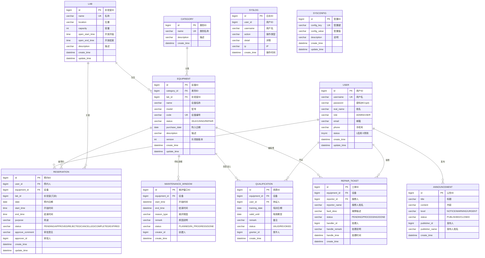

# 智云实验设备预约管理系统 —— 数据库设计文档

> MySQL 8.0 ｜ utf8mb4 ｜ 共 **11 张表**（7 张核心表 + 公告/维护窗口/资质/报修工单 4 张扩展表）

---

## 1. 设计原则

1. **表数量精简**：11 张表覆盖全部业务（核心 7 张 + 治理类扩展 4 张），避免过度设计。
2. **应用层保证关联完整性**：设备↔类别、设备↔实验室、预约↔用户/设备等通过外键字段 + 索引维护，删除时由 Service 层校验关联数据（如"存在未完成预约不可删设备"），删除前不产生孤儿数据。
3. **枚举用字符串存储**：角色、状态列存枚举名称（如 `PENDING`），可读性好、扩展方便，前端做中文映射。
4. **冗余合理**：预约表冗余 `lab_id`，便于按实验室统计，避免每次联表。
5. **乐观锁**：设备表增加 `version` 字段，配合 MyBatis-Plus 乐观锁插件。

---

## 2. E-R 图



---

## 3. 表结构说明

### 3.1 `user` 用户表

| 字段 | 类型 | 约束 | 说明 |
|------|------|------|------|
| id | BIGINT | PK, AUTO_INCREMENT | 用户ID |
| username | VARCHAR(32) | UNIQUE, NOT NULL | 登录账号 |
| password | VARCHAR(100) | NOT NULL | BCrypt 密文（不参与序列化） |
| real_name | VARCHAR(32) | NOT NULL | 姓名 |
| role | VARCHAR(16) | NOT NULL DEFAULT 'USER' | ADMIN 管理员 / USER 用户（学生/教师合并） |
| email | VARCHAR(64) | | 邮箱 |
| phone | VARCHAR(20) | | 手机号 |
| status | TINYINT | NOT NULL DEFAULT 1 | 1启用 / 0禁用 |
| create_time / update_time | DATETIME | | 审计字段 |

索引：`uk_username`、`idx_role`。

### 3.2 `equipment_category` 设备类别表

| 字段 | 类型 | 约束 | 说明 |
|------|------|------|------|
| id | BIGINT | PK | 类别ID |
| name | VARCHAR(50) | UNIQUE | 类别名称 |
| description | VARCHAR(200) | | 描述 |
| create_time | DATETIME | | 创建时间 |

### 3.3 `lab` 实验室表

| 字段 | 类型 | 约束 | 说明 |
|------|------|------|------|
| id | BIGINT | PK | 实验室ID |
| name | VARCHAR(50) | UNIQUE | 名称 |
| location | VARCHAR(100) | | 位置 |
| capacity | INT | | 可容纳人数 |
| open_start_time | TIME | | 开放开始 |
| open_end_time | TIME | | 开放结束 |
| description | VARCHAR(200) | | 描述 |
| create_time / update_time | DATETIME | | 审计字段 |

### 3.4 `equipment` 实验设备表

| 字段 | 类型 | 约束 | 说明 |
|------|------|------|------|
| id | BIGINT | PK | 设备ID |
| category_id | BIGINT | NOT NULL | 类别（逻辑外键） |
| lab_id | BIGINT | NOT NULL | 实验室（逻辑外键） |
| name | VARCHAR(50) | NOT NULL | 设备名称 |
| model | VARCHAR(50) | | 型号 |
| code | VARCHAR(50) | UNIQUE | 设备编号 |
| status | VARCHAR(16) | DEFAULT 'IDLE' | IDLE/REPAIR（IDLE 正常可约；REPAIR 维修中，禁止预约） |
| stock | INT | NOT NULL DEFAULT 1 | 设备总台数（≥1，支持多人同设备同段预约；默认 1） |
| min_minutes | INT | NULL | **本机最短预约时长（分钟）**，NULL=沿用全局配置 |
| max_days | INT | NULL | **本机单次最长跨度（天，含首尾）**，NULL=沿用全局配置 |
| allow_cross_day | TINYINT(1) | NOT NULL DEFAULT 1 | **本机是否允许跨天预约**：1=允许 0=禁止 |
| need_qualification | TINYINT(1) | NOT NULL DEFAULT 0 | **预约本机是否需要操作资质**：1=需要 0=不需要 |
| purchase_date | DATE | | 购入日期 |
| description | VARCHAR(200) | | 描述 |
| image | LONGTEXT | | 设备图片（SVG data URL / URL / base64；为空时前端自动占位图） |
| version | INT | DEFAULT 0 | 乐观锁版本 |
| create_time / update_time | DATETIME | | 审计字段 |

索引：`uk_code`、`idx_category`、`idx_lab`、`idx_status`。

> 占用统计：当前正被使用的台数 `occupiedNow` 由子查询实时计算（`status='APPROVED' AND 时段覆盖当前时刻`），不持久化。预约冲突检测升级为：同设备同时段占用数 `< stock` 才允许新单。
>
> **仪器级预约规则**：`min_minutes / max_days / allow_cross_day` 三个字段构成"本机专属规则"，为 NULL 时回退 `sys_config` 的全局值。`need_qualification = 1` 时该设备的预约需校验 `qualification` 表中的有效资质。

### 3.5 `reservation` 设备预约表（核心表）

| 字段 | 类型 | 约束 | 说明 |
|------|------|------|------|
| id | BIGINT | PK | 预约ID |
| user_id | BIGINT | NOT NULL | 预约人（逻辑外键） |
| equipment_id | BIGINT | NOT NULL | 设备（逻辑外键） |
| lab_id | BIGINT | | 实验室（冗余，便于统计） |
| date | DATE | NOT NULL | 预约开始日期 |
| end_date | DATE | NULL | 预约结束日期（跨天预约时 `end_date >= date`；单日预约留空） |
| start_time | TIME | NOT NULL | 每日开始时间 |
| end_time | TIME | NOT NULL | 结束时间 |
| purpose | VARCHAR(200) | | 用途 |
| status | VARCHAR(16) | DEFAULT 'PENDING' | 六态状态机 |
| approve_comment | VARCHAR(200) | | 审批意见 |
| approver_id | BIGINT | | 审批人 |
| return_image | LONGTEXT | | 归还照片（归还时拍照或上传，base64 data URL/URL） |
| return_note | VARCHAR(255) | | 归还备注（选填） |
| returned_at | DATETIME | | 归还时间（用户拍照完成归还/到期自动完成时记录） |
| create_time / update_time | DATETIME | | 审计字段 |

索引：`idx_user`、`idx_equipment_date`（冲突检测核心索引）、`idx_status`、`idx_date`。

### 3.6 `sys_log` 系统操作日志表

| 字段 | 类型 | 约束 | 说明 |
|------|------|------|------|
| id | BIGINT | PK | 日志ID |
| user_id | BIGINT | | 操作用户ID |
| username | VARCHAR(32) | | 操作用户名 |
| action | VARCHAR(50) | NOT NULL | 操作类型 |
| detail | VARCHAR(500) | | 操作详情 |
| ip | VARCHAR(50) | | 操作IP |
| create_time | DATETIME | | 操作时间 |

索引：`idx_action`、`idx_create_time`。

### 3.7 `sys_config` 系统配置表

| 字段 | 类型 | 约束 | 说明 |
|------|------|------|------|
| id | BIGINT | PK | 配置ID |
| config_key | VARCHAR(64) | UNIQUE | 配置键 |
| config_value | VARCHAR(200) | NOT NULL | 配置值 |
| description | VARCHAR(200) | | 说明 |
| create_time / update_time | DATETIME | | 审计字段 |

内置配置：`reservation_max_days_ahead=30`（最多提前 30 天预约）、`reservation_min_minutes=30`（最短时长）、`reservation_max_duration_days=30`（单次预约最长跨度 30 天，支持跨天连续预约）、`auto_complete_enabled=true`（到期自动完成）、`remind_before_minutes=30`（提前提醒）。

> 全局配置与仪器级规则的关系：`reservation_min_minutes` 与 `reservation_max_duration_days` 是**兜底值**，设备表 `min_minutes / max_days` 非空时以设备配置优先。

### 3.8 `announcement` 系统公告表

| 字段 | 类型 | 约束 | 说明 |
|------|------|------|------|
| id | BIGINT | PK | 公告ID |
| title | VARCHAR(80) | NOT NULL | 标题 |
| content | VARCHAR(1000) | NOT NULL | 内容 |
| level | VARCHAR(16) | DEFAULT 'NOTICE' | 级别：NOTICE 通知 / WARNING 注意 / URGENT 紧急 |
| status | VARCHAR(16) | DEFAULT 'PUBLISHED' | 状态：PUBLISHED 已发布 / CLOSED 已关闭 |
| publisher_id | BIGINT | | 发布人ID |
| publisher_name | VARCHAR(32) | | 发布人姓名（冗余，避免列表关联查询） |
| create_time / update_time | DATETIME | | 审计字段 |

索引：`idx_status`、`idx_create_time`。

> 用户端只读取 `status='PUBLISHED'` 的记录（公告列表 + 首页顶部横幅取最新 3 条）；关闭后立即从用户端消失，但管理端仍可查。

### 3.9 `maintenance_window` 设备维护窗口表

| 字段 | 类型 | 约束 | 说明 |
|------|------|------|------|
| id | BIGINT | PK | 维护窗口ID |
| equipment_id | BIGINT | NOT NULL | 设备（逻辑外键） |
| start_time / end_time | DATETIME | NOT NULL | 维护起止时间 |
| reason_type | VARCHAR(32) | DEFAULT 'ROUTINE' | ROUTINE 例行保养 / CALIBRATION 设备校准 / CONSUMABLE 耗材更换 / SAFETY 安全检查 / TROUBLESHOOT 故障排查 / UPGRADE 软件升级 |
| remark | VARCHAR(200) | | 原因说明 |
| status | VARCHAR(16) | DEFAULT 'PLANNED' | PLANNED 计划 / IN_PROGRESS 执行中 / DONE 已完成 |
| creator_id | BIGINT | | 创建人ID |
| create_time / update_time | DATETIME | | 审计字段 |

索引：`idx_equipment_time (equipment_id, start_time, end_time)`、`idx_status`。

> - 状态按时间**惰性流转**（查询时刷新）：`PLANNED → IN_PROGRESS`（到达开始时间）、`IN_PROGRESS → DONE`（超过结束时间），无需额外定时任务。
> - 预约校验：`equipment_id` 命中且 `status <> 'DONE'` 且时段重叠 → 拒绝预约。
> - 创建校验：与 `reservation` 中 `PENDING/APPROVED` 的重叠记录数 > 0 → **拒绝创建**（先协商调整预约再排期维护）。

### 3.10 `qualification` 设备操作资质表

| 字段 | 类型 | 约束 | 说明 |
|------|------|------|------|
| id | BIGINT | PK | 资质ID |
| equipment_id | BIGINT | NOT NULL | 设备（逻辑外键） |
| user_id | BIGINT | NOT NULL | 持证人（逻辑外键） |
| training_date | DATE | | 培训日期 |
| valid_until | DATE | | 有效期至，NULL=长期有效 |
| remark | VARCHAR(200) | | 备注（培训成绩等） |
| status | VARCHAR(16) | DEFAULT 'VALID' | VALID 有效 / REVOKED 已撤销 |
| grantor_id | BIGINT | | 授予人ID |
| create_time / update_time | DATETIME | | 审计字段 |

索引：`uk_equipment_user (equipment_id, user_id)` 唯一、`idx_user`、`idx_status`。

> - 唯一键保证"同一设备同一用户"只有一条记录，重复授予走**更新**（刷新有效期并恢复 VALID），不产生重复数据。
> - 有效性判定：`status='VALID'` 且（`valid_until IS NULL` 或 `valid_until >= CURDATE()`）。
> - 仅当 `equipment.need_qualification = 1` 时才触发校验。

### 3.11 `repair_ticket` 设备报修工单表

| 字段 | 类型 | 约束 | 说明 |
|------|------|------|------|
| id | BIGINT | PK | 工单ID |
| equipment_id | BIGINT | NOT NULL | 设备（逻辑外键） |
| reporter_id | BIGINT | NOT NULL | 报修人 |
| reporter_name | VARCHAR(32) | | 报修人姓名（冗余） |
| fault_desc | VARCHAR(500) | NOT NULL | 故障描述 |
| status | VARCHAR(16) | DEFAULT 'PENDING' | PENDING 待处理 / PROCESSING 处理中 / DONE 已完成 |
| handler_id | BIGINT | | 处理人ID |
| handle_remark | VARCHAR(500) | | 处理说明 |
| handle_time | DATETIME | | 处理完成时间 |
| create_time / update_time | DATETIME | | 审计字段 |

索引：`idx_equipment`、`idx_reporter`、`idx_status`。

> 状态流转：`待处理 → 处理中 → 已完成`；完成时写入 `handle_time`；已完成工单不允许重复处理（服务层拦截）。

---

## 4. 关键 SQL 说明

### 4.1 冲突检测（时间重叠判断）

```sql
SELECT COUNT(*)
FROM reservation
WHERE equipment_id = #{equipmentId}
  AND date = #{date}
  AND status IN ('PENDING', 'APPROVED')          -- 仅未完成预约占用时间
  AND start_time < #{end}                         -- 区间 [start,end) 重叠判定
  AND end_time > #{start};
```

### 4.2 悲观锁（并发控制）

```sql
SELECT * FROM equipment WHERE id = #{id} FOR UPDATE;
```

### 4.3 设备使用时长排行

```sql
SELECT e.name AS name,
       SUM(TIMESTAMPDIFF(MINUTE, r.start_time, r.end_time)) AS totalMinutes
FROM reservation r JOIN equipment e ON r.equipment_id = e.id
WHERE r.status IN ('APPROVED', 'COMPLETED')
GROUP BY r.equipment_id, e.name
ORDER BY totalMinutes DESC
LIMIT 5;
```

### 4.4 近7日预约趋势

```sql
SELECT DATE_FORMAT(date, '%m-%d') AS date, COUNT(*) AS count,
       SUM(CASE WHEN status = 'APPROVED' THEN 1 ELSE 0 END) AS approved
FROM reservation
WHERE date >= DATE_SUB(CURDATE(), INTERVAL 6 DAY)
GROUP BY date ORDER BY date;
```

### 4.5 维护窗口与预约冲突检测（创建维护窗口时）

时段重叠沿用与预约冲突一致的"半开区间"判定：`已有时段结束 > 新时段开始 AND 已有时段开始 < 新时段结束`，跨天用 `CONCAT(IFNULL(end_date, date), ' ', end_time)` 拼成完整时间点。

```sql
-- 统计与维护窗口时段重叠的未完成预约数；返回值 > 0 时拒绝创建维护窗口
SELECT COUNT(*)
FROM reservation
WHERE equipment_id = #{equipmentId}
  AND status IN ('PENDING', 'APPROVED')
  AND CONCAT(IFNULL(end_date, date), ' ', end_time) > #{start}
  AND CONCAT(date, ' ', start_time) < #{end};
```

### 4.6 维护窗口状态惰性流转（进入列表查询前执行）

```sql
-- 到达开始时间：计划 → 执行中
UPDATE maintenance_window SET status = 'IN_PROGRESS'
WHERE status = 'PLANNED' AND start_time <= NOW() AND end_time > NOW();

-- 超过结束时间：执行中 → 已完成
UPDATE maintenance_window SET status = 'DONE'
WHERE status = 'IN_PROGRESS' AND end_time <= NOW();
```

### 4.7 有效资质判定（预约校验）

```sql
SELECT COUNT(*)
FROM qualification
WHERE equipment_id = #{equipmentId}
  AND user_id = #{userId}
  AND status = 'VALID'
  AND (valid_until IS NULL OR valid_until >= CURDATE());
```

---

## 5. 初始化数据说明

`db/init.sql` 内置演示数据：

- **用户**：admin（管理员）、teacher1/teacher2（教师）、student1/student2（学生），密码均为 `123456`（BCrypt 密文）。
- **类别 4 类、实验室 3 间、设备 12 台**（含空闲/使用中/维修中三种状态；其中 4 台标记为"需要操作资质"，多台配置了专属预约规则）。
- **预约 15 条**：日期基于 `CURDATE()` 相对生成，覆盖 已完成/已驳回/已取消/已过期/待审批/已通过 全状态，保证统计看板与列表开箱即有数据展示。
- **系统配置 5 项、示例日志 4 条**。
- **公告 4 条**：含 3 条已发布（紧急/通知/注意各一）+ 1 条已关闭，覆盖三级徽标与状态筛选。
- **维护窗口 3 条**：2 条未来排期（设备校准 / 例行保养）+ 1 条已完成（故障排查），覆盖全部状态。
- **操作资质 4 条**：3 条有效 + 1 条已撤销（用于演示"过期/撤销后不可预约"）。
- **报修工单 3 条**：待处理 / 处理中 / 已完成各一，覆盖完整流转。

> 说明：`init.sql` 可重复执行（先 DROP 再 CREATE）；日期使用相对表达式，任何时间导入都能看到"新鲜"的演示数据。
