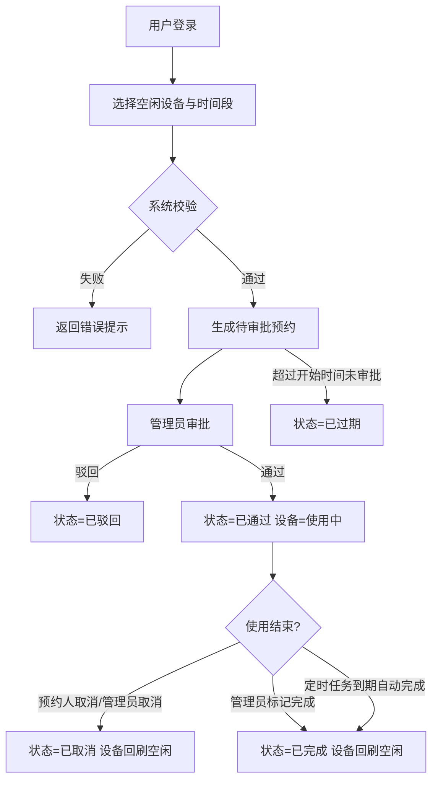
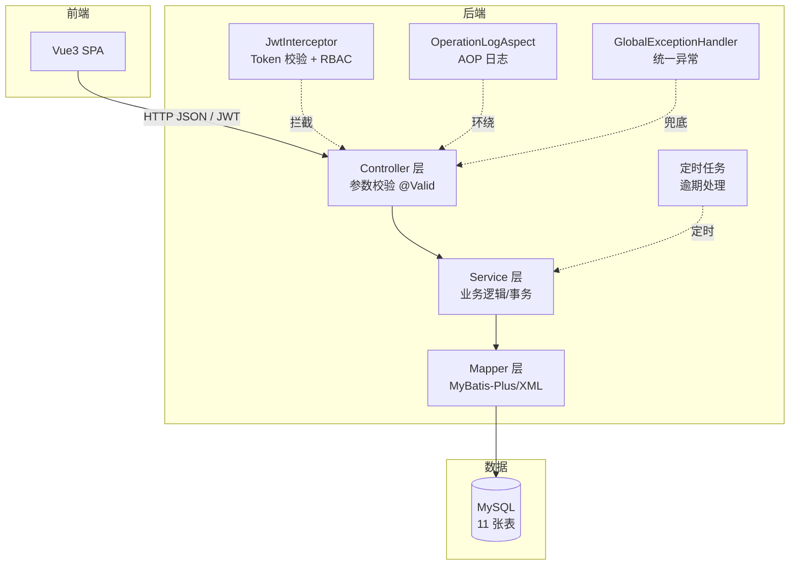

# 智云实验设备预约管理系统 —— 系统设计文档

> 版本：v2.6（V6 改版：用户自助归还拍照 + 登录页 UI 升级）｜ 技术栈：Spring Boot 2.7 + MyBatis-Plus + MySQL 8 + Vue 3 + Element Plus

---

## 1. 项目概述

### 1.1 项目背景

高校实验室普遍存在设备利用率不透明、预约流程靠线下登记、时间冲突频发等问题。本系统面向高校实验室管理人员、教师与学生三类用户，提供设备信息管理、在线预约、审批、逾期处理与数据统计的一体化解决方案，使设备资源分配透明化、流程线上化。

### 1.2 系统范围

| 项目 | 说明 |
|------|------|
| 系统名称 | 实验室设备预约管理系统 |
| 系统形态 | B/S 架构，前后端分离 Web 应用 |
| 核心业务 | 设备预约（含冲突校验）、审批流转、设备/实验室/用户管理、统计看板、公告、维护窗口与报修工单、资质准入、操作日志 |
| 部署形态 | 单体应用（Spring Boot） + 独立前端（Vue3 SPA），单数据库 MySQL |

### 1.3 设计目标

1. **可用性**：完成设备预约全流程闭环，覆盖"申请 → 审批 → 使用 → 完成/取消/过期"状态机。
2. **正确性**：通过悲观锁 + 时间重叠检测，保证同一设备同一时间段不被重复预约。
3. **规范性**：统一响应结构、统一异常处理、统一参数校验、操作日志留痕。
4. **可扩展性**：分层架构（Controller/Service/Mapper），配置项驱动预约规则。

---

## 2. 需求分析

### 2.1 用户角色与权限

| 角色 | 权限说明 |
|------|----------|
| 管理员 ADMIN | 全部权限：设备/实验室/类别/用户管理、预约审批、维护窗口排期与报修处理、资质授予/撤销、公告发布、统计看板、操作日志、系统配置 |
| 用户 USER | 设备查询与发起预约、查看/取消本人预约、自助归还、设备报修、查看公告与本人资质 |

> 说明：教师与学生统一为普通 **用户（USER）** 角色，权限差异由业务规则（如资质准入）而非角色硬编码体现。

### 2.2 系统用例图

```mermaid
graph TD
    subgraph 系统边界
        UC1[注册/登录]
        UC2[浏览/检索设备]
        UC3[发起预约申请]
        UC4[查看/取消本人预约]
        UC5[审批/驳回预约]
        UC6[完成/取消任意预约]
        UC7[设备增删改查/状态维护]
        UC8[实验室管理]
        UC9[设备类别管理]
        UC10[用户管理/角色分配]
        UC11[数据统计看板]
        UC12[操作日志查询]
        UC13[系统配置维护]
        UC14[自助归还拍照]
        UC15[提交设备报修]
        UC16[查看公告/我的资质]
        UC17[维护窗口排期]
        UC18[报修工单处理]
        UC19[资质授予/撤销]
        UC20[公告发布管理]
        UC21[仪器级预约规则配置]
    end

    用户 --> UC1
    用户 --> UC2
    用户 --> UC3
    用户 --> UC4
    用户 --> UC14
    用户 --> UC15
    用户 --> UC16
    管理员 --> UC1
    管理员 --> UC5
    管理员 --> UC6
    管理员 --> UC7
    管理员 --> UC8
    管理员 --> UC9
    管理员 --> UC10
    管理员 --> UC11
    管理员 --> UC12
    管理员 --> UC13
    管理员 --> UC17
    管理员 --> UC18
    管理员 --> UC19
    管理员 --> UC20
    管理员 --> UC21
```



### 2.3 核心业务流程

#### 2.3.1 设备预约流程



#### 2.3.2 系统校验规则（预约申请）

| 校验项 | 规则 | 数据来源 |
|--------|------|----------|
| 日期 | 不早于今天；最多提前 30 天 | 请求参数 / 系统配置 |
| 时长 | 最短时长与最长跨度：**设备专属规则优先，未配置回退全局**（全局默认最短 30 分钟、最长跨度 30 天含首尾） | 设备表 / 系统配置 |
| 跨天限制 | 设备 `allow_cross_day = 0` 时仅可预约同一天内的时段 | 设备表 |
| 设备状态 | 非"维修中" | 设备表 |
| **维护窗口** | 预约时段不与设备维护窗口（计划/执行中）重叠 | 维护窗口表 |
| **操作资质** | 设备 `need_qualification = 1` 时，用户须持有效资质（`VALID` 且未过期） | 资质表 |
| 实验室开放时间 | 预约时段 ∈ [开放开始, 开放结束] | 实验室表 |
| 时间冲突 | 同设备同时段占用数 < 设备总台数 `stock` | 预约表（冲突检测） |

> 校验按上述顺序在 `ReservationService.createReservation` 中串行执行，任一项不通过即抛出 `BusinessException` 并返回可读原因；设备行加 `FOR UPDATE` 悲观锁保证并发场景下校验与写入的原子性。

---

## 3. 系统架构设计

### 3.1 技术选型

| 层次 | 技术 | 说明 |
|------|------|------|
| 前端 | Vue 3 + Element Plus + Axios + ECharts | CDN 单页应用，Hash 路由 |
| 后端 | Spring Boot 2.7.18 | 基于 JDK 8+ |
| 持久层 | MyBatis-Plus 3.5.3 | 分页插件、乐观锁、字段自动填充 |
| 数据库 | MySQL 8.0 | utf8mb4，11 张表 |
| 认证 | JWT（jjwt 0.11.5） | 无状态 Token + 拦截器鉴权 |
| 密码 | BCrypt（spring-security-crypto） | 不可逆加密 |
| 其他 | Lombok、AOP 操作日志、@Scheduled 定时任务 | |

### 3.2 后端分层架构



---

## 4. 功能模块设计

### 4.1 用户管理模块

- 注册：用户名唯一性校验、密码 BCrypt 加密、默认学生角色。
- 登录：校验密码与账号状态，签发 24h JWT。
- 用户维护（管理员）：分页查询、新增、编辑（角色/状态）、重置密码、删除（存在未完成预约时禁止删除；不能删除/禁用自己）。
- 规则保护：系统至少保留一名管理员；禁用账号后 Token 立即失效（拦截器每次查库校验）。

### 4.2 设备管理模块

- 设备字段：名称、型号、编号（唯一）、类别、所属实验室、状态（空闲/使用中/维修中）、购入日期、描述。
- 检索：关键字（名称/编号/型号）+ 类别 + 实验室 + 状态 组合筛选分页。
- 维护（管理员）：增删改、状态变更（如标记维修）。删除前校验无未完成预约。
- 状态流转：空闲 → 使用中（审批通过）→ 空闲（完成/取消/到期）；维修中为人工维护状态。

### 4.3 预约管理模块（核心）

- 发起预约：完整校验规则见 2.3.2；**悲观锁 + 冲突检测** 保证并发安全。
- 审批（管理员）：通过 → 设备置"使用中"；驳回 → 必填原因。
- 取消：预约人可取消本人待审批/已通过的预约（已开始的使用中预约仅管理员可取消）；管理员可取消任意未完成预约。
- 完成（预约人）：使用完毕，在"我的预约"拍照上传归还。
- 逾期处理（定时任务，每分钟）：
  1. 已通过但已过结束时间 → 自动"已完成"，设备回刷空闲；
  2. 待审批但已过开始时间 → 自动"已过期"。
- 记录查询：本人预约 / 全部预约（状态、关键字、日期范围筛选）。

### 4.4 实验室管理模块

- 维护实验室基础信息：名称（唯一）、位置、容量、开放时间、描述。
- 实验室与设备的关联：设备通过 `lab_id` 归属实验室；删除实验室前校验无关联设备。
- 预约时校验预约时段 ∈ 实验室开放时间。

### 4.5 系统管理模块

- 统计看板：今日预约/待审批/已通过、设备总数/空闲/使用中/维修中、用户数/实验室数、近7日趋势、状态分布、实验室预约量 TOP5、设备使用时长 TOP5。
- 操作日志：AOP 自动记录关键操作（谁、做了什么、IP、时间），支持按操作类型与关键字筛选查询。
- 系统配置：预约规则键值对（提前天数/最短时长/最长时长/自动完成开关），修改即时生效；同时作为**仪器级规则的全局兜底值**。

### 4.6 公告模块

- 管理员：发布 / 编辑 / 关闭 / 删除公告，级别分 通知（NOTICE）/ 注意（WARNING）/ 紧急（URGENT）。
- 用户端：设备预约页顶部展示最新公告横幅（本地记忆已关闭项，可一键跳转全部公告），「系统公告」页查看全部已发布公告。
- 可见性规则：仅 `status='PUBLISHED'` 对用户可见，关闭后立即从用户端消失；列表按发布时间倒序，横幅取最新 3 条。

### 4.7 维护与报修模块

- **维护窗口**（管理员）：为设备创建停机排期（6 类维护原因），窗口内设备不可被预约。
  - 创建校验：与已有预约（待审批/已通过）时段重叠则**拒绝创建**并提示冲突条数；
  - 状态流转：计划 → 执行中 → 已完成，按时间**惰性流转**（查询时刷新，无需定时任务）；
  - 仅"计划"状态可删除，可手动"结束维护"提前完成。
- **报修工单**：用户提交报修（设备 + 故障描述）→ 管理员受理（处理中）→ 完成（记录处理人与处理说明）。
  - 状态机：`待处理 PENDING → 处理中 PROCESSING → 已完成 DONE`，已完成不可重复处理。

### 4.8 资质准入模块

- 管理员：「资质认证」页为设备授予 / 撤销用户操作资质，记录培训日期、有效期至、备注。
- 有效性判定：`status='VALID'` 且（`valid_until` 为空或未过期）；唯一键约束保证"设备+用户"唯一，重复授予走更新刷新有效期。
- 与预约联动：设备 `need_qualification = 1` 时，预约链第 5 步校验持证情况，无有效资质直接拒绝。

---

## 5. 接口设计（RESTful 汇总）

统一前缀 `/api`，统一响应 `Result{code, message, data}`；除登录注册外均需 `Authorization: Bearer <token>`。

| 模块 | 方法与路径 | 说明 | 权限 |
|------|-----------|------|------|
| 认证 | POST /auth/login | 登录 | 公开 |
| 认证 | POST /auth/register | 注册（学生） | 公开 |
| 用户 | GET /user/me | 当前用户 | 登录 |
| 用户 | PUT /user/password | 修改密码 | 登录 |
| 用户 | GET/POST /user/page, /user | 分页查询/新增 | 管理员 |
| 用户 | PUT/DELETE /user/{id} | 更新/删除 | 管理员 |
| 用户 | PUT /user/{id}/reset-password | 重置密码 | 管理员 |
| 设备 | GET /equipment/page | 分页检索（多条件） | 登录 |
| 设备 | GET /equipment/list-bookable | 可预约设备 | 登录 |
| 设备 | GET /equipment/{id} | 详情 | 登录 |
| 设备 | POST/PUT/DELETE /equipment... | 增删改 | 管理员 |
| 设备 | PUT /equipment/{id}/status | 状态变更 | 管理员 |
| 实验室 | GET /lab/list, /lab/page | 列表/分页 | 登录 |
| 实验室 | POST/PUT/DELETE /lab... | 维护 | 管理员 |
| 类别 | GET /category/list | 列表 | 登录 |
| 类别 | POST/PUT/DELETE /category... | 维护 | 管理员 |
| 预约 | POST /reservation | 发起预约 | 登录 |
| 预约 | GET /reservation/my | 我的预约 | 登录 |
| 预约 | POST /reservation/{id}/cancel | 取消 | 本人/管理员 |
| 预约 | GET /reservation/page | 全部预约 | 管理员 |
| 预约 | POST /reservation/{id}/approve | 审批 | 管理员 |
| 预约 | POST /reservation/{id}/complete | 完成 | 管理员 |
| 系统 | GET /admin/dashboard | 统计看板 | 管理员 |
| 系统 | GET /admin/logs/page, /admin/logs/actions | 日志分页 / 操作类型 | 管理员 |
| 系统 | GET/PUT /admin/config... | 配置 | 管理员 |
| 公告 | GET /announcement/list, /announcement/banner | 已发布公告 / 最新 3 条 | 登录 |
| 公告 | GET/POST/PUT/DELETE /announcement/page, /{id}, /{id}/close | 管理端维护 | 管理员 |
| 维护 | GET/POST/DELETE /maintenance/page, /, /{id}/complete, /{id} | 维护窗口（冲突拒绝） | 管理员 |
| 资质 | GET /qualification/my | 我的资质 | 登录 |
| 资质 | GET/POST /qualification/page, /, /{id}/revoke | 授予/撤销/查询 | 管理员 |
| 报修 | POST/GET /repair, /repair/my | 提交报修 / 我的报修 | 登录 |
| 报修 | GET/POST /repair/page, /{id}/handle | 全部工单 / 受理与完成 | 管理员 |

---

## 6. 核心难点与实现方案

### 6.1 预约时间冲突检测与并发控制

**问题**：两名用户同时为同一设备提交同一时间段预约，若先查后插，可能双双通过。

**方案（悲观锁）**：

```
@Transactional
1. SELECT * FROM equipment WHERE id = ? FOR UPDATE   -- 锁定设备行
2. 业务校验（时长/开放时间/维修状态）
3. SELECT COUNT(*) FROM reservation
   WHERE equipment_id=? AND date=? AND status IN ('PENDING','APPROVED')
     AND start_time < ?end AND end_time > ?start      -- 重叠检测
4. COUNT=0 则插入，否则抛业务异常
```

事务提交后行锁释放，第二个请求在步骤 1 阻塞，随后在步骤 3 检测到冲突。该方案逻辑直观、可讲解性强，符合毕设"适中难度"定位。

### 6.2 预约状态机

| 状态 | 可转入 |
|------|--------|
| PENDING 待审批 | APPROVED / REJECTED / CANCELLED / EXPIRED |
| APPROVED 已通过 | COMPLETED / CANCELLED（已开始仅管理员） |
| REJECTED / CANCELLED / COMPLETED / EXPIRED | 终态 |

状态迁移集中在校验与更新方法内，保证不出现非法跳转；设备状态在关键节点（审批通过/取消/完成/到期）联动回刷（`refreshEquipmentStatus`：无进行中预约则恢复空闲，且不覆盖维修状态）。

### 6.3 认证与权限控制

- JWT 无状态认证：登录签发 Token（含 userId/username/role，24h 过期）。
- `JwtInterceptor`：解析 Token → 查库校验账号存在且启用（禁用即时生效）→ 写入 `UserContext`（ThreadLocal）→ 校验 `@RequireRole` 注解 → 请求结束清理。
- 密码 BCrypt 加密存储，永不返回给前端（@JsonIgnore）。

### 6.4 操作日志

`@OperationLog("审批预约")` 注解 + AOP 切面：方法执行成功后自动记录 `sys_log`（用户、动作、详情、IP、时间），日志失败不影响主流程。目前覆盖登录、审批预约、新增/更新/删除设备、归还设备、发布/编辑/关闭/删除公告、创建/删除维护窗口、授予/撤销资质、提交与处理报修等关键动作。

### 6.5 仪器级预约规则（配置化校验）

**问题**：不同设备的合理预约粒度差异很大（示波器按小时、精密仪器按天），全局统一配置无法覆盖。

**方案**：`equipment` 表增加 `min_minutes / max_days / allow_cross_day` 三个可空字段，`ReservationService` 取值时**设备配置优先、全局配置兜底**：

```java
long minMinutes = equipment.getMinMinutes() != null
        ? equipment.getMinMinutes() : getConfigLong("reservation_min_minutes", 30L);
long maxDurationDays = equipment.getMaxDays() != null
        ? equipment.getMaxDays() : getConfigLong("reservation_max_duration_days", 30L);
if (equipment.getAllowCrossDay() != null && equipment.getAllowCrossDay() == 0
        && !date.equals(endDate)) { /* 拒绝跨天 */ }
```

设备表单以"留空 = 沿用全局"的下拉预设呈现，避免配置歧义；更新时用 `LambdaUpdateWrapper` 显式 `set`，保证可以将规则**清空回退全局**（MyBatis-Plus 默认忽略 null 字段）。

### 6.6 维护窗口与预约的互斥

**问题**：设备需要停机保养/校准，但该时段可能已有预约，若直接停机将产生"已批准却无法使用"的矛盾数据。

**方案**：
- **创建时前置拦截**：以与预约冲突检测一致的"半开区间"判定（`已有结束 > 新开始 AND 已有开始 < 新结束`），统计重叠的 `PENDING/APPROVED` 预约数，>0 则拒绝创建并提示条数；
- **预约时反向拦截**：`maintenanceService.hasActiveWindow(equipmentId, start, end)` 在预约校验链第 4 步执行，命中未结束的维护窗口即拒绝；
- **状态惰性流转**：不引入额外定时任务，进入列表查询前用两条 `UPDATE` 依据当前时间推进 `PLANNED → IN_PROGRESS → DONE`，实现简单且自愈。

### 6.7 资质准入

设备通过 `need_qualification` 开关启用准入；校验方法 `hasValidQualification(equipmentId, userId)` 判定 `status='VALID'` 且（`valid_until IS NULL` 或未过期）。`qualification` 表对 `(equipment_id, user_id)` 建唯一键，重复授予自动转为"刷新有效期"，避免脏数据；撤销后立即失去预约资格，形成"培训 → 授权 → 预约 → 到期/撤销"的完整闭环。

### 6.8 数据统计

统计 SQL 集中定义于 `ReservationMapper.xml` / `EquipmentMapper.xml`：
近7日趋势（GROUP BY date）、状态分布（GROUP BY status）、实验室排行（JOIN lab）、设备使用时长（TIMESTAMPDIFF 累计）。

---

## 7. 非功能性设计

| 维度 | 方案 |
|------|------|
| 统一响应 | `Result{code,message,data}`，code 语义：200/400/401/403/500 |
| 统一异常 | `@RestControllerAdvice`：业务异常/参数校验异常/未知异常分类处理 |
| 参数校验 | DTO + `@Valid`（@NotBlank/@Size/@Pattern/@FutureOrPresent 等）+ 全局约束异常处理 |
| 跨域 | WebConfig 配置 CORS，允许前端独立部署访问 |
| 定时任务 | `@EnableScheduling` + `@Scheduled(fixedDelay=60s)`，异常隔离不影响主流程 |
| 日志 | Slf4j 业务日志 + sys_log 操作日志双层 |

---

## 8. 部署与运行

1. **数据库**：执行 `db/init.sql`（自动建库建表 + 演示数据），修改 `backend/src/main/resources/application.yml` 中的数据库账号密码。
2. **后端**：`cd backend && mvn spring-boot:run`，默认 `http://localhost:8080/api`。
3. **前端**：任意静态服务器托管 `frontend/` 目录（如 `npx http-server frontend -p 5173`），浏览器访问即可；前后端分离通过 CORS 互通。
4. **演示账号**（密码均 123456）：`admin`（管理员）、`teacher1`（教师）、`student1`（学生）。

---

## 9. 附录：毕业论文章节建议

```
第1章 绪论（背景/意义/国内外现状/论文结构）
第2章 相关技术介绍（Spring Boot/MyBatis-Plus/Vue3/JWT/MySQL）
第3章 系统分析（可行性/需求分析/用例图/业务流程）
第4章 系统设计（总体架构/功能模块/数据库设计/接口设计/核心算法设计）
第5章 系统实现（各模块代码与界面展示/核心难点代码解析）
第6章 系统测试（测试环境/功能测试用例/结果分析）
第7章 总结与展望
```

> 论文中的图可直接复用本文档 mermaid 源码（用例图/流程图/架构图/E-R 图），推荐使用 Typora / VS Code + Markdown Preview Mermaid 导出为图片。
